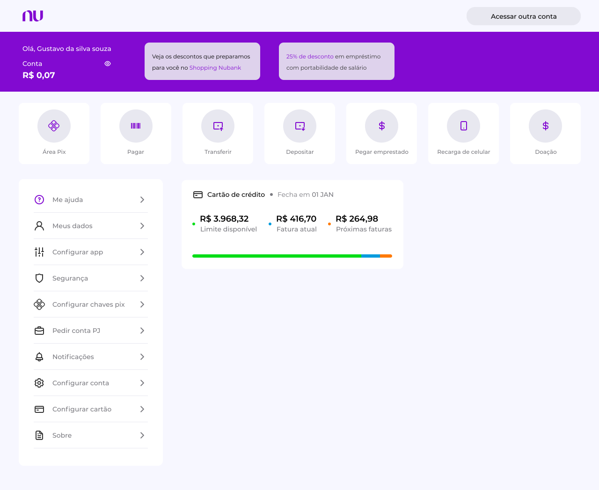

<h1 align="center">
    
</h1>

<p align="center">
  <a href="#-technologies">Technologies</a>&nbsp;&nbsp;&nbsp;|&nbsp;&nbsp;&nbsp;
  <a href="#-project">Project</a>&nbsp;&nbsp;&nbsp;|&nbsp;&nbsp;&nbsp;
  <a href="#-layout">Layout</a>&nbsp;&nbsp;&nbsp;|&nbsp;&nbsp;&nbsp;
</p>

<br>

<p align="center">
  
</p>


### You can run the demo on [Nubank web](https://nubank-web-fuh.vercel.app/)

## Test on your machine

First, install the dependecies:

```bash
npm install
# or
yarn

```

Second, run the command line:

```bash
npm run dev
# or
yarn dev
```

Open [http://localhost:3000](http://localhost:3000) with your browser to see the result.

## 🚀 Technologies

This project is developed with the technologies below:

- [Next.js](https://nextjs.org/)
- [React](https://reactjs.org)
- [TypeScript](https://www.typescriptlang.org/)
- [NextAuth](https://next-auth.js.org/)
- [React Beautiful DnD](https://github.com/atlassian/react-beautiful-dnd)

## 💻 Project

This is a project study! 

Nubank web is a project to study OAuth authentication and drag n drop

## 🔖 Layout

You can visualize the project with the link below:

- [Layout Web](https://www.figma.com/file/Xy4QuNIMc6yst6I5Kl1Lat/Nubank-web-(Apresentation)?node-id=0%3A1) 

<p align="center">Developed by Gustavo Souza with 💜</p>